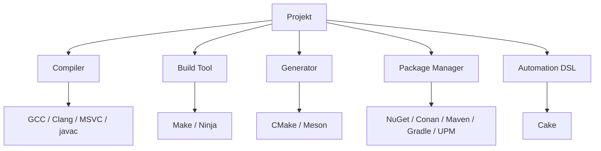
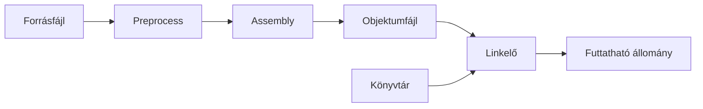
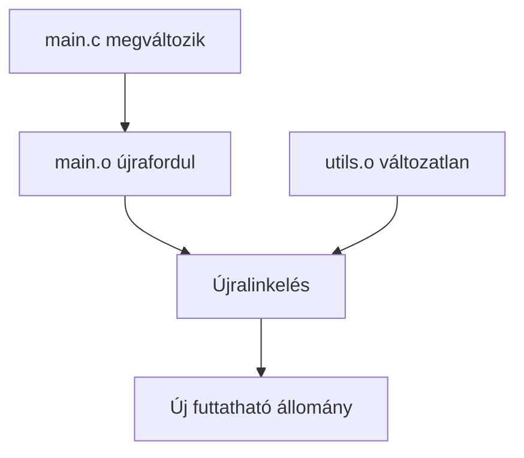
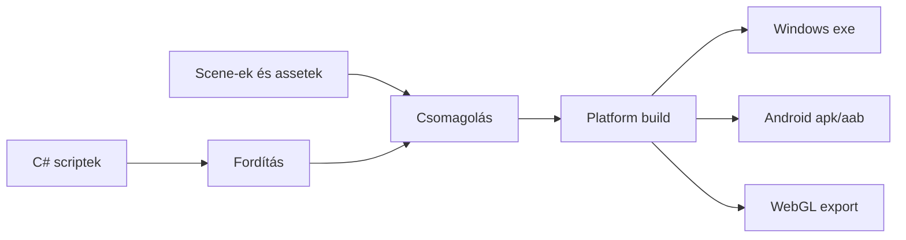

# Modern szoftverfejlesztési eszközök 5.

## Build rendszerek, csomagkezelés és automatizálás

## Tanulási célok

A lecke végére a hallgató képes lesz:

- megmagyarázni, miért van szükség automatizált build folyamatokra;
- elkülöníteni a fordító, build eszköz, build-generátor és csomagkezelő szerepét;
- értelmezni a fordítás főbb lépéseit és kimeneteit;
- rövid Makefile példát olvasni és alapvető célokat, függőségeket felismerni;
- megkülönböztetni a Make, Ninja, CMake és Meson szerepét;
- értelmezni a Debug és Release build közti különbséget;
- elmagyarázni az artifact fogalmát;
- C# és Unity környezetben is értelmezni a build, package és publish fogalmakat.

---

## 1. Miért lett fontos a build automatizálása?

Kisebb projekteknél sokáig működött az a megközelítés, hogy a fejlesztő a saját IDE-jében vagy termináljában lefordította a kódot, majd ha a program elindult, késznek tekintette a feladatot. Ez a szemlélet egy darabig működik, de nagyobb projekteknél gyorsan problémássá válik.

### Tipikus gondok kézi vagy félig kézi fordítás esetén

- **Nem garantált, hogy másik gépen is lefordul a projekt.**
- **Nem garantált, hogy ugyanazzal a konfigurációval épül fel a szoftver.**
- **A tesztek és a build gyakran külön úton futnak.**
- **A külső könyvtárak kezelése kézi és hibára hajlamos.**
- **A fordítás folyamata nehezen ismételhető.**
- **A fejlesztői környezethez túlzottan kötött lesz a projekt.**

A modern fejlesztés célja nem pusztán az, hogy a program „nálam leforduljon”, hanem az, hogy **ismételhető, automatizálható és hordozható módon** álljon elő ugyanaz az eredmény.

### Mit jelent ez a gyakorlatban?

A build folyamatnak nem csak egyszer kell sikeresen lefutnia, hanem:

- más fejlesztő gépén is ugyanúgy kell működnie;
- a CI/CD környezetben is ugyanazt az eredményt kell adnia;
- különböző build konfigurációk mellett is kontrollálhatónak kell maradnia;
- világosnak kell lennie, hogy melyik lépés hol történik: fordítás, linkelés, teszt, csomagolás, publikálás.

---

## 2. A build folyamat jellemző lépései

A build rendszer nem csak fordít. Egy modern build folyamat több, egymásra épülő lépésből állhat.

### Tipikus fázisok

1. **Configure**
   - a projekt és a környezet felderítése;
   - fordító, könyvtárak, include útvonalak, platformspecifikus elemek felismerése.

2. **Build / Compile**
   - a forráskód lefordítása köztes vagy végső gépi reprezentációvá.

3. **Link**
   - objektumfájlok és könyvtárak összekapcsolása futtatható állománnyá vagy könyvtárrá.

4. **Test**
   - automatikus tesztek futtatása.

5. **Package**
   - telepíthető vagy továbbadható csomag előállítása.

6. **Publish**
   - a build eredményének tárolása, közzététele vagy átadása más folyamatoknak.

### Miért fontos ez a bontás?

Mert a modern eszközök nem feltétlenül ugyanazt a feladatot végzik. Van, ami csak fordít, van, ami csak buildlépéseket vezérel, és van, ami egy magasabb szintű leírásból generál futtatható build rendszert.

### Build pipeline áttekintése


A fenti ábra nem azt jelenti, hogy minden projekt minden lépést ugyanúgy használ. Egy egyszerű konzolos programnál a `Package` és `Publish` minimális lehet, míg egy nagyobb terméknél külön csomagolási, aláírási, publikálási és tárolási lépések is megjelennek.

---

## 3. Ki mit csinál? – az eszközök szerepei

A build ökoszisztéma tipikus szereplői:

### Fordítók

- **GCC**
- **Clang**
- **MSVC**
- **javac**

Feladatuk: a forráskód gépileg feldolgozható formára alakítása.

### Build eszközök

- **Make**
- **Ninja**

Feladatuk: a buildlépések végrehajtása a szabályok és függőségek alapján.

### Build-generátorok / magasabb szintű projektleíró eszközök

- **CMake**
- **Meson**

Feladatuk: magasabb szintű projektleírásból tényleges build rendszer előállítása.

### Csomagkezelők

- **NuGet** (.NET)
- **Conan** (C/C++)
- **Maven**, **Gradle** (Java)
- Unity esetén gyakran **UPM** (Unity Package Manager)

Feladatuk: külső függőségek letöltése, verziózása és integrálása.

### Build automatizálási DSL / script-alapú rendszer

- **Cake** (.NET / C#)

Feladatuk: automatizált build, teszt és publish folyamatok scriptelhető leírása.

### Kapcsolatrendszer áttekintése



A leggyakoribb félreértés az, hogy ezek az eszközök „mind build rendszerek”. Tág értelemben ez igaz lehet, de szakmailag fontos látni, hogy **más-más szinten avatkoznak be** a folyamatba.

---

## 4. Fordítási alapfogalmak

### Fordító (compiler)

A fordító a forráskódot gépileg feldolgozható formára alakítja. Ez lehet köztes reprezentáció vagy végső futtatható bináris felé vezető lépés.

### Forrásfájl

Tipikus példák:

- `.c`
- `.cpp`
- `.java`
- `.cs`

### Fejlécfájl / interfészleírás

C/C++ esetén tipikusan `.h` fájl, amely deklarációkat tartalmaz.

### Objektumfájl

Részlegesen lefordított állomány, még nem önállóan futtatható.

Tipikus kiterjesztések:

- `.o`
- `.obj`

### Linkelés

Az objektumfájlok és könyvtárak összekapcsolása futtatható állománnyá vagy könyvtárrá.

### Futtatható állomány

A rendszer által közvetlenül indítható program.

Tipikus példák:

- Windows: `.exe`
- Linux: ELF bináris

### Könyvtár

Újrafelhasználható kódrészletek csomagolása.

### A fordítás egyszerűsített lánca



Ez persze leegyszerűsítés, de oktatási célra jól mutatja, hogy a fordítás nem egyetlen varázslatos lépés, hanem több fázisból álló folyamat.

---

## 5. Statikus és dinamikus könyvtárak

### Statikus könyvtár

Előre lefordított, újrafelhasználható kódrészletek gyűjteménye.

- Tipikus kiterjesztések: `.lib`, `.a`
- A szükséges kódrészek **linkeléskor beépülnek** a programba.

**Előny:** egyszerűbb terjesztés, a szükséges kód a futtatható állomány része.

**Hátrány:** nagyobb bináris méret.

### Dinamikus könyvtár

Megosztott, újrafelhasználható kódrészletek gyűjteménye.

- Tipikus kiterjesztések: `.dll`, `.so`
- Fordításkor a program hivatkozásokat tartalmaz a könyvtár elemeire.
- A tényleges implementáció **futáskor** töltődik be.

**Előny:** kisebb futtatható állomány, könnyebb közös használat.

**Hátrány:** futáskor szükség van a megfelelő külső könyvtárra is.

### Mikor melyik előnyös?

- **Statikus könyvtár** esetén egyszerűbb lehet a terjesztés, mert a program kevésbé függ a futási környezettől.
- **Dinamikus könyvtár** esetén könnyebb a közös komponensek frissítése és újrafelhasználása.
- A választás gyakran technikai, platformfüggő és üzemeltetési szempontoktól is függ.

---

## 6. GCC és Clang röviden

A GCC és a Clang egyaránt széles körben használt C/C++ fordítóeszközlánc.

### Közös jellemzők

Mindkettő képes:

- preprocesszált kimenetet készíteni;
- assembly kimenetet generálni;
- objektumfájlt előállítani;
- linkelni.

### Tipikus GCC/Clang kapcsolók

```bash
gcc -E main.c -o main.i   # preprocesszált kimenet
gcc -S main.c -o main.s   # assembly kimenet
gcc -c main.c -o main.o   # objektumfájl
gcc main.c -o main        # futtatható állomány
```

Ugyanez Clanggal is működik hasonló módon:

```bash
clang -E main.c -o main.i
clang -S main.c -o main.s
clang -c main.c -o main.o
clang main.c -o main
```

### Rövid különbség

- **GCC**: klasszikus, nagyon elterjedt megoldás.
- **Clang**: az LLVM ökoszisztéma része, gyakran jó diagnosztikával és moduláris felépítéssel.

A build rendszerek szempontjából azonban a fő kérdés nem az, hogy melyik a „jobb”, hanem az, hogy a fordítás **automatizálható és reprodukálható** legyen.

### Miért hasznos a köztes kimenetek ismerete?

Mert segít megérteni:

- hogy a fordítás több lépésből áll;
- miért van értelme külön objektumfájlokat kezelni;
- hogyan lehet az inkrementális buildet megvalósítani;
- miért kell külön gondolkodni fordítóról és linkelőről.

---

## 7. Inkrementális build

### Mi az inkrementális build?

Az inkrementális build során **csak a megváltozott vagy azokat érintő részek** fordulnak újra.

Ez nagy projektekben kritikus, mert egy kisebb módosítás után általában nincs szükség a teljes rendszer újrafordítására.

### Miért fontos?

- gyorsabb visszacsatolást ad a fejlesztőnek;
- csökkenti a build időt;
- nagyobb projektekben jelentősen javítja a produktivitást.

### A kihívás

Meg kell tudni mondani, hogy egy változás után:

- mely forrásfájlokat kell újrafordítani;
- mely célokat kell újralinkelni;
- milyen függőségi kapcsolatok érintettek.

A klasszikus megoldások egyike erre a **make**.

### Egyszerű példa változás hatására



A lényeg: nem kell mindent újrafordítani, de azt sem szabad eltéveszteni, hogy **mit** kell újrafordítani. Ezt a függőségi logikát kezeli automatizáltan a build eszköz.

---

## 8. Make és Makefile

A **make** és a **Makefile** a klasszikus Unix build automatizálás fontos eszközei.

A Makefile szabályok és függőségek segítségével írja le a build lépéseit.

### Alapelemek

- **célok** (*targets*)
- **függőségek** (*dependencies*)
- **parancsok** (*recipes*)

### Mire jó a Makefile?

- hosszabb fordító- és linkerparancsok leírására;
- változók és útvonalak kezelésére;
- inkrementális build támogatására;
- gyakori feladatok szabályozására (`all`, `clean`, stb.).

### Egyszerű Makefile példa

```make
CC=gcc
CFLAGS=-Wall -O2

app: main.o utils.o
	$(CC) main.o utils.o -o app

main.o: main.c utils.h
	$(CC) $(CFLAGS) -c main.c

utils.o: utils.c utils.h
	$(CC) $(CFLAGS) -c utils.c

clean:
	rm -f *.o app
```

### Hogyan olvassuk ezt a példát?

- Az `app` cél függ a `main.o` és `utils.o` állományoktól.
- Ha ezek közül valamelyik hiányzik vagy régebbi a forrásnál, a `make` újraépíti.
- A `clean` cél nem fordít, hanem takarít.
- A `CC` és `CFLAGS` változókkal a parancsok rövidebbek és újrahasznosíthatók.

### Korlátok

- nagyobb projektnél nehezen karbantartható lehet;
- platformfüggő részletek gondot okozhatnak;
- bonyolult Makefile-ok nehezen olvashatók.

Tanulási lehetőség:

- <https://makefiletutorial.com/>

---

## 9. A make fontosabb opciói és változói

### Gyakori make opciók

- `-jN`: legfeljebb `N` párhuzamos feladat futtatása;
- `-n`: a parancsok kiírása végrehajtás nélkül;
- `-B`: minden cél újraépítése;
- `-f <fájl>`: megadott Makefile használata;
- `-C <könyvtár>`: futtatás másik könyvtárból.

### Gyakori Makefile-változók

- `CC`: fordító;
- `CFLAGS`: fordítónak átadott kapcsolók;
- `CPPFLAGS`: preprocesszor kapcsolói;
- `LDFLAGS`: linker kapcsolói;
- `LDLIBS`: linkelendő könyvtárak.

Példa:

```make
CFLAGS = -Wall -O2 -g
LDFLAGS = -L./lib
LDLIBS = -lm
```

### Fontos megkülönböztetés

A `make` saját opciói és a fordítónak átadott flag-ek **nem ugyanazok**.

- `make -j4` a `make` viselkedését szabályozza;
- `CFLAGS=-O2 -Wall` viszont a fordítóhoz továbbított kapcsolókat jelenti.

Ez apróságnak tűnik, de sok félreértéstől megóv.

---

## 10. Ninja

A **Ninja** gyors, kis overheadű build-végrehajtó eszköz.

### Fő jellemzői

- erős fókusz a sebességen;
- különösen hatékony inkrementális build esetén;
- buildlépések gyors végrehajtására optimalizált.

### Fontos különbség

A Ninja **nem magas szintű projektleíró eszköz**, hanem egy gyors build-végrehajtó rendszer.

A Ninja leírások jellemzően alacsony szintűek, ezért nagyobb projekteknél gyakran **más eszköz generálja őket**, például:

- **CMake**
- **Meson**

### Egyszerű Ninja példa

```ninja
rule cc
  command = gcc -c -o $out $in
  description = CC $out

rule link
  command = gcc -o $out $in
  description = LINK $out

build source1.o: cc source1.c
build source2.o: cc source2.c
build myprogram: link source1.o source2.o
```

### Mikor előnyös?

A Ninja különösen akkor hasznos, ha:

- a projekt nagy;
- sok fájl fordul;
- a buildlépések gyakran ismétlődnek;
- a magasabb szintű projektleírást már más eszköz kezeli.

Főoldal:

- <https://ninja-build.org/>

---

## 11. Külső csomagok és függőségek kezelése

Kisebb projekteknél kézzel is megadható, hogy egy-egy külső könyvtár hol található. Nagyobb projekteknél ez gyorsan kezelhetetlenné válik.

### Miért nehéz a kézi dependency-kezelés?

- több elérési utat kell megadni;
- platformonként eltérhet a telepítési hely;
- nem várható el, hogy minden gépen ugyanoda legyen telepítve a csomag;
- több verzió is élhet egymás mellett.

Ezért van szükség csomagkezelőkre és magasabb szintű build eszközökre.

### Tipikus problémák nagyobb csapatban

- „Nálam működik, nálad miért nem?”
- Különböző könyvtárverziók használata.
- Kézzel másolt dependency-k, amelyek később eltűnnek vagy elavulnak.
- Lokális útvonalak, amelyek másik gépen értelmezhetetlenek.

Itt válik a build rendszer kérdése szervezési kérdéssé is: nem csak a fordító parancsairól beszélünk, hanem a projekt reprodukálható előállításáról.

---

## 12. CMake

A **CMake** platformfüggetlen build-generátor és projektleíró eszköz.

### Mire jó?

- magasabb szintű leírást ad a projektről;
- többféle build rendszert tud generálni;
- segít a külső csomagok és toolchainek integrációjában;
- több platformon is használható.

### Tipikus generátorok

- Make
- Ninja
- Visual Studio projektfájlok

### Egyszerű példa

```cmake
cmake_minimum_required(VERSION 3.20)
project(Demo C)

add_executable(demo main.c)
```

### Hasznos kiegészítők

- **CTest** – tesztek futtatása;
- **CMake GUI / ccmake** – finomhangolás;
- **CPack** – csomagkészítés;
- **CCache** – fordítás gyorsítása cache segítségével.

### Miért népszerű?

Mert ugyanazt a projektet képes:

- különböző platformokra előkészíteni;
- különböző fordítókkal használni;
- Make, Ninja vagy IDE-projekt felé is exportálni.

Főoldal:

- <https://cmake.org/>

---

## 13. Meson

A **Meson** modern, nyílt forráskódú build rendszer és projektleíró eszköz.

### Jellemzői

- saját DSL-lel rendelkezik;
- erősen típusos;
- nem Turing-teljes;
- gyors és modern fejlesztési folyamathoz készült;
- jól együttműködik a Ninjával.

### Meson fázisok

- **setup**
- **compile**
- **test**

### Minimális példa

```meson
project('tutorial', 'c')
executable('demo', 'main.c')
```

### Függőség hozzáadása

```meson
project('tutorial', 'c')
gtkdep = dependency('gtk+-3.0')
executable('demo', 'main.c', dependencies: gtkdep)
```

### Tipikus futtatás

```bash
meson setup builddir
cd builddir
meson compile
meson test
```

### Mikor kedvelik sokan?

- jól olvasható DSL-je miatt;
- mert sok esetben tisztább, mint a túlburjánzott Makefile-ok;
- mert gyors és kényelmes együttműködést ad a Ninjával.

Főoldal:

- <https://mesonbuild.com/>

---

## 14. Build konfigurációk: Debug és Release

A build konfigurációk azt szabályozzák, hogy a projekt milyen céllal épül fel.

### Debug

Hibakeresésre optimalizált build.

- debug szimbólumokat tartalmaz;
- kevesebb vagy kikapcsolt optimalizáció;
- könnyebb hibakeresés.

### Release

Végfelhasználónak szánt, optimalizált build.

- kisebb vagy gyorsabb futás;
- általában agresszívebb optimalizáció;
- a felhasználó jellemzően ezt kapja meg.

### A két konfiguráció közti tipikus különbségek

- eltérő flagek;
- eltérő teljesítmény;
- eltérő hibakereshetőség;
- eltérő binárisméret;
- esetenként eltérő futási viselkedés.

### Miért fontos ezt külön kezelni?

Mert ugyanaz a forráskód eltérően viselkedhet vagy legalábbis eltérően diagnosztizálható különböző buildmódokban. A fejlesztő számára a Debug build kényelmesebb, a végfelhasználó számára viszont a Release build a természetes.

---

## 15. Artifact fogalma

Az **artifact** a build folyamat eredményeként előálló kimenet.

### Tipikus artifactok

- futtatható állomány;
- könyvtár;
- teszt riport;
- telepítőcsomag;
- exportált platformcsomag.

### Miért fontos?

A CI/CD folyamatokban az artifactok:

- tárolhatók;
- továbbadhatók más lépéseknek;
- közzétehetők;
- telepíthetők.

Különösen a **Package** és **Publish** lépések során válnak központi jelentőségűvé.

### Egyszerű szemlélet

Nem minden artifact végfelhasználói termék. Egy tesztjelentés vagy coverage riport is artifact lehet, ha a build eredményeként keletkezik és tovább használjuk.

---

## 16. C# csomagkezelés röviden

### NuGet

A **NuGet** a .NET ökoszisztéma alapvető csomagkezelője.

- Visual Studio környezetben széles körben használt;
- fejlesztői könyvtárak letöltésére és kezelésére szolgál;
- együttműködik MSBuilddel és .NET Core / .NET rendszerekkel.

Főoldal:

- <https://www.nuget.org/>

### Chocolatey

Windows csomagkezelő, bizonyos esetekben a fejlesztői eszközök telepítésére használható.

### Miért érdekes ez játékfejlesztési közegben is?

Mert a C# ökoszisztéma fogalmai részben Unityben is visszaköszönnek, még ha a konkrét eszközök és prioritások nem is mindig ugyanazok.

---

## 17. Cake (C# build automatizálás)

A **Cake** egy C#-alapú build automatizálási megoldás, saját DSL-lel.

### Mire használható?

- build feladatok leírására;
- tisztításra (`Clean`);
- fordításra (`Build`);
- tesztelésre (`Test`);
- összetettebb automatizációs folyamatokra.

### Példa

```csharp
var target = Argument("target", "Test");
var configuration = Argument("configuration", "Release");

Task("Clean")
    .Does(() => {
        CleanDirectory($"./src/Example/bin/{configuration}");
    });

Task("Build")
    .IsDependentOn("Clean")
    .Does(() => {
        DotNetBuild("./src/Example.sln", new DotNetBuildSettings {
            Configuration = configuration,
        });
    });

Task("Test")
    .IsDependentOn("Build")
    .Does(() => {
        DotNetTest("./src/Example.sln", new DotNetTestSettings {
            Configuration = configuration,
            NoBuild = true,
        });
    });

RunTarget(target);
```

Futtatás például:

```bash
dotnet cake
```

### Mire jó oktatási példaként?

Arra, hogy megmutassa: a build automatizálás nem csak shell script vagy Makefile lehet, hanem magasabb szintű, programozható leírás is.

Főoldal:

- <https://cakebuild.net/>

---

## 18. Build játékfejlesztésben (Unity)

Unity esetében a build fogalma tágabb, mint pusztán a `.cs` fájlok fordítása.

### A build részei Unity-ben

- C# script-ek fordítása;
- assetek feldolgozása;
- scene-ek csomagolása;
- platformspecifikus export;
- scripting backend beállítása;
- IL2CPP transzpilálás vagy Mono backend használata.

### Tipikus célplatformok

- Windows
- Android
- WebGL

### Unity build módok

- **Development Build** – hibakereséshez és diagnosztikához;
- **Release / Production Build** – végfelhasználóknak szánt optimalizált változat.

Unity környezetben gyakran megjelenő opciók:

- Development Build
- Script Debugging
- Autoconnect Profiler

### Unity build folyamat egyszerűsítve



Ez jól mutatja, hogy Unitynél a build jóval több, mint egy fordítóparancs futtatása: a tartalom és a platformcsomagolás legalább olyan fontos, mint maga a scriptfordítás.

---

## 19. Artifact Unity-ben

Unity esetén az artifact gyakran maga a játék vagy annak platformspecifikus csomagja.

### Példák

- **Windows build:** `.exe` + adatkönyvtár
- **Android build:** `.apk` vagy `.aab`
- **WebGL build:** exportált webes csomag
- logok, symbolok, crash report csomagok is lehetnek artifactok

Az artifact lényegében minden olyan kimenet, amely szükséges ahhoz, hogy a játék egy másik helyen futtatható, telepíthető vagy tesztelhető legyen.

### Miért hasznos ez külön kiemelve?

Mert játékfejlesztésben könnyű azt hinni, hogy az artifact egyszerűen maga a „kész játék”. Valójában sokféle kapcsolódó kimenet is létezhet, amelyek a fejlesztési és tesztelési folyamatban ugyanilyen fontosak.

---

## 20. Unity és csomagkezelés

A klasszikus .NET világban a **NuGet** a természetes csomagkezelő. Unity esetén azonban gyakran más a helyzet.

### Unity Package Manager (UPM)

Unityben a természetes dependency-kezelési megoldás jellemzően a **Unity Package Manager**.

### Fontos megjegyzés

- külső .NET csomagok integrálása külön figyelmet igényelhet;
- Unity és klasszikus .NET projektek csomagkezelése nem mindig ugyanaz;
- játékfejlesztési környezetben a package, publish és artifact fogalmak továbbra is érvényesek.

### Oktatási tanulság

Ugyanaz a „csomagkezelés” szó különböző ökoszisztémákban eltérő eszközöket jelenthet. Ezért mindig érdemes tisztázni, hogy melyik környezetben dolgozunk.

---

## 21. CI/CD kapcsolat

A build rendszerek egyik legfontosabb szerepe, hogy **automatizálhatóvá** tegyék a fejlesztési folyamatot.

### Mire jó ez a gyakorlatban?

- automatikus build minden commit vagy merge után;
- tesztek futtatása build közben;
- nightly build előállítása;
- platformspecifikus export automatizálása;
- artifactok tárolása és publikálása.

Unity esetén például automatizálható:

- Windows kliens build;
- Android build;
- teszt build;
- nightly build.

### Mi a fő üzenet?

A build rendszer itt már nem csak fejlesztői kényelmi eszköz, hanem a csapatmunka és a minőségbiztosítás alapja.

---

## 22. Best practices

### 1. Ne commitoljunk build outputot Gitbe

A build output generált állomány, nem forráskód. Általában nem célszerű verziókezelni.

### 2. Használjunk out-of-source buildet

A build külön könyvtárba kerüljön, a forrásfa maradjon tiszta.

### 3. Az elérési utak legyenek hordozhatók

Kerüljük a hardcode-olt abszolút útvonalakat. Használjunk relatív vagy konfigurálható elérési utakat.

### 4. A függőségeket csomagkezelővel vagy build rendszerrel kezeljük

Ne kézzel másoljuk a dependency-ket, hanem reprodukálható módon szerezzük be őket.

### 5. A build legyen scriptelhető és ismételhető

A buildnek alkalmasnak kell lennie arra, hogy fejlesztői gépen és CI/CD környezetben is ugyanúgy fusson.

### 6. Törekedjünk reprodukálható buildre

Ugyanabból a forrásból és konfigurációból ugyanaz az eredmény álljon elő.

### 7. Válasszuk szét a szerepeket

A fordító, a build eszköz, a generátor és a csomagkezelő nem ugyanaz. Minél tisztábban értjük a szerepeiket, annál könnyebb hibát keresni és rendszert tervezni.

---

## 23. Rövid összefoglalás

Ebben a leckében áttekintettük:

- a build automatizálás szükségességét;
- a build folyamat tipikus lépéseit;
- a fordítás alapfogalmait;
- az inkrementális build jelentőségét;
- a Make, Ninja, CMake és Meson szerepét;
- a Debug és Release build konfigurációkat;
- az artifact fogalmát;
- a C# és Unity sajátosságait a build, csomagkezelés és publish terén.

A fő tanulság: a modern build rendszer nem pusztán fordít, hanem **szervezi, automatizálja és ismételhetővé teszi** a szoftver előállítását.

---

## 24. Önálló gondolkodást segítő kérdések

1. Miért nem elég az, hogy egy projekt a fejlesztő saját gépén lefordul?
2. Miben különbözik a fordító és a build eszköz szerepe?
3. Miért fontos az inkrementális build?
4. Mikor lehet előnyösebb a Ninja, mint a klasszikus Make?
5. Miért van szükség magasabb szintű eszközökre, mint a CMake vagy a Meson?
6. Miben más a build fogalma Unity környezetben, mint egy egyszerű C program esetén?
7. Milyen artifactok keletkezhetnek egy Unity-alapú játékprojektben?
8. Miért fontos a reprodukálható build a CI/CD folyamatokban?
9. Milyen problémát old meg a csomagkezelő, amit kézi dependency-kezeléssel nehéz lenne biztosan megoldani?
10. Miért hasznos külön kezelni a Debug és Release konfigurációkat?

---
