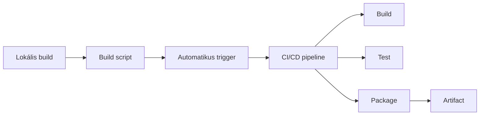
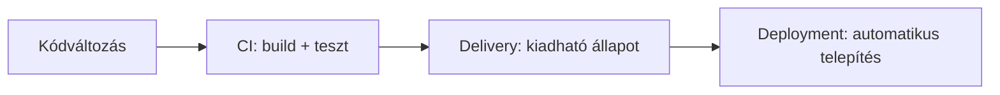
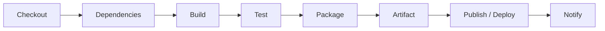
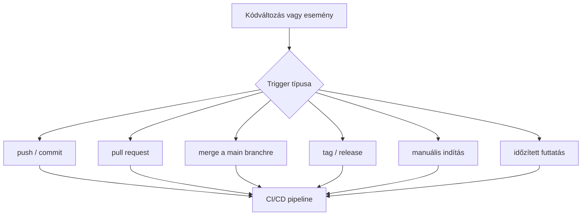
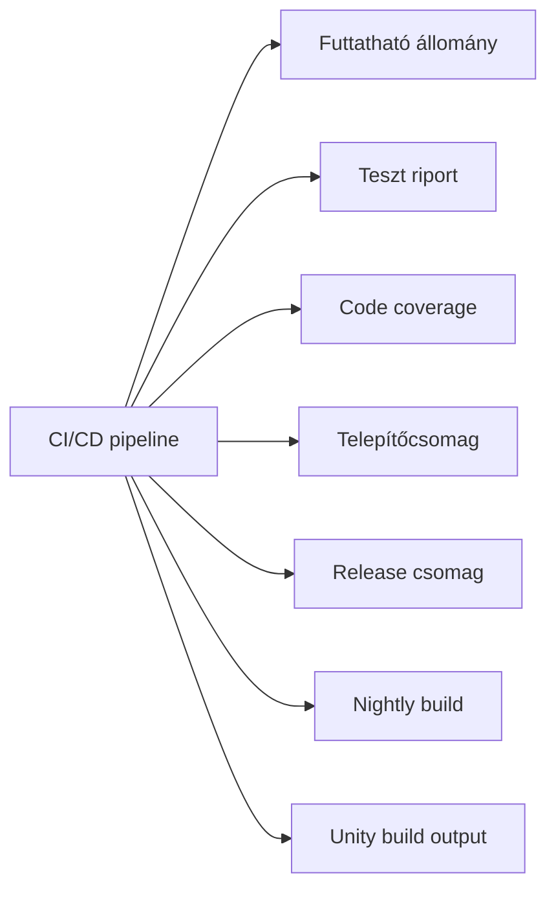
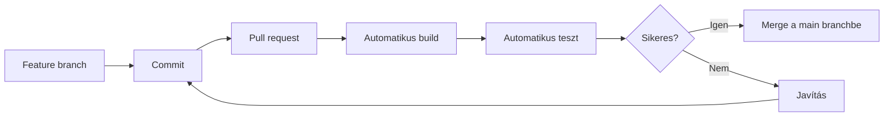

# Folytonos integráció (CI/CD)

## Leírás

Ebben a leckében a lokális buildfolyamatoktól jutunk el a csapat- és projektszintű automatizálásig. A cél annak megértése, hogy a fordítás, tesztelés, csomagolás és közzététel miként válik közös, ismételhető és ellenőrizhető munkafolyamattá.

A lecke a korábbi build rendszerekről szóló anyagra épül. Ott a lokális buildfolyamat, az artifact fogalma, valamint a build automatizálás alapjai jelentek meg. Itt ugyanezeket a lépéseket emeljük át CI/CD környezetbe.

## Tanulási célok

A lecke végére a hallgató:

- érti, hogyan kapcsolódik a lokális build a CI/CD folyamathoz,
- el tudja különíteni a CI, Continuous Delivery és Continuous Deployment fogalmát,
- meg tudja magyarázni, mi a pipeline,
- fel tud sorolni tipikus pipeline lépéseket és indítási eseményeket,
- ismeri a pipeline tipikus kimeneteit,
- érti a feature branch + pull request alapú munkafolyamat szerepét,
- alapvetően ismeri a Jenkins és a GitHub Actions szerepét,
- lát egy minimális GitHub Actions workflow példát,
- el tudja helyezni a Unity projekteket CI/CD környezetben is.

## Előismeretek

A lecke feltételezi a következő fogalmak alapszintű ismeretét:

- fordítás és linkelés,
- build rendszerek,
- artifact,
- verziókezelés Git segítségével,
- alapvető tesztelési fogalmak.

---

## 1. Build rendszerektől a CI/CD-ig

Korábban a lokális buildfolyamat volt a fókusz:

- fordítás,
- linkelés,
- tesztelés,
- artifact előállítása.

A következő lépés ezek automatizálása csapat- és projektszinten:

- közös repository használata,
- automatikus build,
- automatikus tesztelés,
- automatikus visszajelzés,
- mérőszámok gyűjtése,
- egységes folyamat minden fejlesztő számára.

### Lényeg

A CI/CD a build rendszerekre épül: a lokális automatizálásból közös, ismételhető fejlesztési munkafolyamat lesz.



---

## 2. Alapfogalmak

### CI (Continuous Integration)

A forráskód változásainak gyakori integrálása közös repository-ba, automatikus builddel és automatikus teszteléssel.

A cél az, hogy a hibák minél hamarabb kiderüljenek, és a közös ág stabil maradjon.

### Continuous Delivery

A szoftver folyamatosan kiadható állapotban van. A release előkészítése automatizált, de a végső kiadás még lehet emberi döntés.

### Continuous Deployment

A sikeres pipeline után a változás automatikusan települ célkörnyezetbe vagy akár éles rendszerbe.

### DevOps

A fejlesztés és üzemeltetés összehangolt szemlélete. A cél a gyorsabb szállítás, a megbízhatóbb működés, az automatizálás és a folyamatos visszajelzés.

### Rövid különbségtétel

- **CI**: build + teszt automatikusan
- **Delivery**: bármikor kiadható állapot
- **Deployment**: automatikus telepítés
- **DevOps**: tágabb működési és szervezési szemlélet



---

## 3. Folytonos integráció dióhéjban

Hagyományos esetben a fejlesztő:

1. megírja a kódot,
2. lefordítja,
3. futtatja a teszteket,
4. majd valamilyen módon közzéteszi az eredményt.

CI esetén ugyanez automatizáltan történik:

- a kód közös tárhelyre kerül,
- a rendszer lehúzza a friss változatot,
- buildet és teszteket futtat,
- visszajelzést ad,
- és szükség esetén kiadható csomagot is előállít.

### Miért hasznos?

- gyorsabb visszajelzés,
- hamarabb kiderülő integrációs hibák,
- következetes ellenőrzés,
- jobban látható fejlesztési folyamat.

---

## 4. Mi az a pipeline?

A pipeline a fejlesztési folyamat automatizált lépéssorozata. Tipikusan egymás után futó szakaszokból áll, de bizonyos részei párhuzamosíthatók.

A pipeline célja, hogy a forráskódból ellenőrzött, tesztelt és kiadható eredmény készüljön.

A pipeline működését gyakran konfigurációs fájl írja le, például:

- `Jenkinsfile`
- `.github/workflows/*.yml`

### Pipeline tipikus lépései

1. checkout / forráskód letöltése,
2. függőségek előkészítése,
3. build,
4. tesztelés,
5. csomagolás,
6. artifact előállítása,
7. publish vagy delivery,
8. deploy,
9. értesítés / visszajelzés.



---

## 5. Mikor indul el egy pipeline?

A pipeline futása eseményhez vagy időzítéshez kötött.

### Tipikus indítási lehetőségek

- push vagy commit egy branchre,
- pull request megnyitása vagy frissítése,
- merge a main branchre,
- tag vagy release létrehozása,
- manuális indítás,
- időzített futtatás, például nightly build.

### Miért fontos ez?

A trigger határozza meg, hogy a pipeline mikor és milyen változásra reagáljon.



---

## 6. A pipeline tipikus kimenetei

A pipeline nem kizárólag lefutási állapotot ad vissza. Nem csak annyit mond, hogy sikeres vagy hibás lett, hanem konkrét kimeneteket is előállít.

### Tipikus kimenetek

- futtatható állomány,
- teszt riport,
- code coverage riport,
- telepítőcsomag,
- release csomag,
- nightly build csomag,
- egyéb build outputok.

### Unity-s példák

- Windows build,
- Android APK vagy AAB,
- WebGL export,
- Development build,
- Release build.



### Lényeg

A CI/CD nemcsak ellenőriz, hanem kézzelfogható build eredményeket is termel.

---

## 7. CI tipikus munkafolyamatban

Egy modern Git-alapú csapatmunkában a fejlesztő jellemzően külön feature branch-en dolgozik.

### Tipikus folyamat

1. fejlesztés feature branch-en,
2. commit,
3. pull request,
4. automatikus build és teszt,
5. merge csak sikeres pipeline után,
6. a main branch mindig fordulóképes és stabil marad.



### Miért fontos?

A CI nemcsak automatizálás, hanem fegyelmezett közös fejlesztési munkafolyamat is.

---

## 8. CI eszközök és fejlődési út

### Egyszerű megoldások

- PowerShell vagy Bash szkriptek,
- esemény- vagy időzített futtatás.

### Központibb megoldások

- távoli build szerver,
- közös webes visszajelzés,
- egységes környezet.

### Izolált megoldások

- konténerizált build és teszt,
- kontrollált könyvtár- és verziókészlet,
- reprodukálható környezet.

### Példák

- Make, MSBuild,
- Jenkins,
- GitHub Actions,
- GitLab CI,
- CircleCI,
- Docker,
- Kubernetes,
- OpenEmbedded,
- Yocto.

---

## 9. Jenkins röviden

A Jenkins egy nyílt forráskódú, széles körben használt CI/CD eszköz.

### Fő jellemzők

- elosztott működés,
- plugin alapú bővíthetőség,
- Docker integráció,
- idő- és eseményvezérelt futtatás,
- pipeline alapú működés.

### Fontos fogalmak

- **Pipeline**: teljes munkafolyamat
- **Node**: futtató gép
- **Stage**: logikai szakasz
- **Step**: konkrét lépés

A Jenkins jó példa arra, hogyan válik a build és a release folyamat programozhatóvá.

---

## 10. GitHub Actions röviden

A GitHub Actions a GitHub-ba épített CI/CD eszköz.

### Fő jellemzők

- workflow alapú működés,
- YAML alapú konfiguráció,
- a workflow fájlok helye: `.github/workflows/`,
- trigger-ek eseményekhez vagy időzítéshez köthetők,
- különböző runner környezetek használhatók.

### Fő elemek

- **on**: trigger meghatározása,
- **job**: önálló futási egység,
- **step**: a jobon belüli konkrét lépés,
- **runner**: a futtatási környezet.

### Miért hasznos?

A build, teszt és artifact-kezelés közvetlenül a repositoryhoz kapcsolódhat.

---

## 11. GitHub Actions és Jenkins összevetése

A két megoldás szemléletben sokszor hasonló.

### Közös pontok

- YAML vagy deklaratív pipeline leírás,
- trigger alapú indítás,
- több lépéses workflow,
- külső komponensek integrálása,
- Docker használat,
- build + test + artifact folyamatok.

### Egyszerű különbség

- **Jenkins**: külön kiszolgálót és infrastruktúrát igényelhet
- **GitHub Actions**: közvetlenül a GitHub repository részeként használható

---

## 12. Minimális GitHub Actions workflow

Az alábbi példa egy egyszerű .NET CI workflow-t mutat:

```yaml
name: .NET CI

on:
  push:
    branches: [ "main" ]

jobs:
  build-and-test:
    runs-on: ubuntu-latest

    steps:
      - name: Checkout
        uses: actions/checkout@v4

      - name: Setup .NET
        uses: actions/setup-dotnet@v4
        with:
          dotnet-version: '8.0.x'

      - name: Restore
        run: dotnet restore

      - name: Build
        run: dotnet build --no-restore --configuration Release

      - name: Test
        run: dotnet test --no-build --configuration Release

      - name: Upload artifact
        uses: actions/upload-artifact@v4
        with:
          name: build-output
          path: .
```

### Mit mutat a példa?

- a workflow triggerét,
- a runner környezetet,
- a checkout lépést,
- a .NET környezet előkészítését,
- a restore, build és test lépéseket,
- az artifact feltöltését.

---

## 13. Unity CI/CD környezetben

A Unity projekt is beilleszthető CI/CD folyamatba.

### Tipikus lépések

- commit a repositoryba,
- automatikus build,
- automatikus teszt,
- artifact előállítása,
- release vagy test build közzététele.

### Lehetséges buildtípusok

- Development build,
- Release build.

### Tipikus Unity artifactok

- Windows build,
- Android build,
- WebGL export.

### Időzített lehetőségek

- nightly build,
- teszt build.

---

## 14. A folytonos integráció előnyei

- automatikus build és teszt,
- gyors visszajelzés,
- integrációs hibák gyorsabb felismerése,
- követhető állapot,
- automatikusan előálló riportok és metrikák,
- moduláris fejlesztés támogatása,
- mindig legyen demonstrálható verzió.

---

## 15. A folytonos integráció korlátai és hátrányai

- önmagában nem garantálja a minőséget,
- a tesztek minősége meghatározó,
- a build rendszer és pipeline kialakítása időigényes,
- nagyon kis projekteknél nem mindig éri meg,
- legacy rendszereknél költséges lehet a bevezetés,
- kritikus rendszereknél különösen fontos a megfelelő validáció,
- az automatizmus nem helyettesítheti teljesen az emberi minőségi felügyeletet.

---

## 16. Gyakori hibák és anti-patternök

### Tipikus problémák

- túl lassú pipeline,
- instabil tesztek,
- túl sok manuális lépés,
- “works on my machine” jelenség,
- nincs artifact mentés,
- nincs értesítés vagy láthatóság,
- minden branch mindenhová deployol.

### A “works on my machine” jelenség pontosabban

Nem az a baj, hogy a fejlesztői és a CI környezet nem teljesen azonos. A probléma akkor jelentkezik, ha a különbségek nincsenek kontrollálva, és a lokálisan működő build vagy teszt nem reprodukálható a közös pipeline-ban.

### Miért veszélyesek ezek?

A rosszul kialakított CI/CD folyamat nem gyorsítja, hanem akadályozza a fejlesztést.

---

## 17. Continuous Delivery röviden

A Continuous Delivery célja, hogy a szoftver folyamatosan kiadható állapotban maradjon.

### Előnyök

- gyorsabb reagálás,
- gyakoribb visszajelzés,
- jobb szállítási fegyelem,
- megbízhatóbb verziók.

### Korlátok

- nem minden rendszer frissíthető folyamatosan,
- bizonyos területeken külön validáció szükséges,
- a felhasználási környezet elfedheti a hibákat,
- kritikus rendszereknél az emberi jóváhagyás szerepe megmarad.

---

## 18. Összefoglalás

Ebben a leckében a lokális build automatizálásból indultunk ki, és eljutottunk a CI/CD szervezett, csapatmunkára épülő világáig. A központi fogalom a pipeline, amely automatizált lépésekből áll, eseményekre vagy időzítésre indul, és konkrét build eredményeket állít elő. Megnéztük a CI, Delivery és Deployment közti különbséget, a Git-alapú munkafolyamat szerepét, valamint a Jenkins és GitHub Actions helyét is.

A gyakorlati rész szempontjából különösen fontos, hogy a CI/CD nem öncélú: a cél a gyors visszajelzés, a reprodukálható build, a követhető folyamat és a stabil közös ág fenntartása.

---

## Kulcsfogalmak

- CI
- Continuous Delivery
- Continuous Deployment
- DevOps
- pipeline
- trigger
- artifact
- workflow
- runner
- branch
- pull request
- build
- test
- release
- deploy

---

## Ellenőrző kérdések

1. Mi a különbség a CI, Continuous Delivery és Continuous Deployment között?
2. Mi a pipeline szerepe a modern fejlesztési folyamatban?
3. Milyen események indíthatnak el egy pipeline-t?
4. Milyen tipikus kimeneteket állíthat elő egy CI/CD pipeline?
5. Miért fontos a feature branch + pull request alapú munkafolyamat?
6. Miben különbözik a Jenkins és a GitHub Actions alaphelyzete?
7. Mit jelent a “works on my machine” jelenség CI/CD környezetben?
8. Miért nem elég önmagában a CI a magas minőség garantálásához?

---

## Továbblépés

A következő gyakorlati lépés egy egyszerű .NET projekt CI workflow-jának elkészítése lehet GitHub Actions segítségével. Jó kiindulópont lehet egy kis játéklogika vagy UI-projekt, amelyhez build, teszt és artifact feltöltés is könnyen bemutatható.
